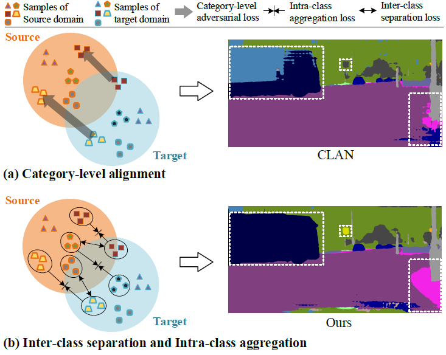
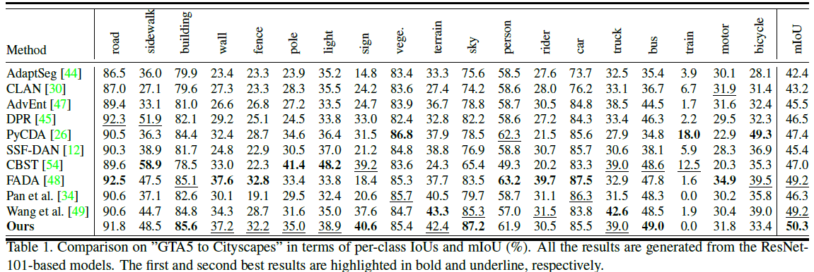
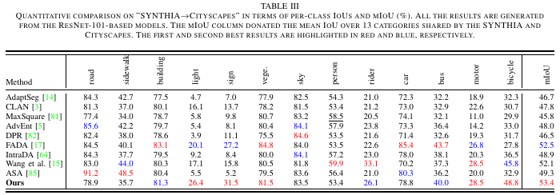
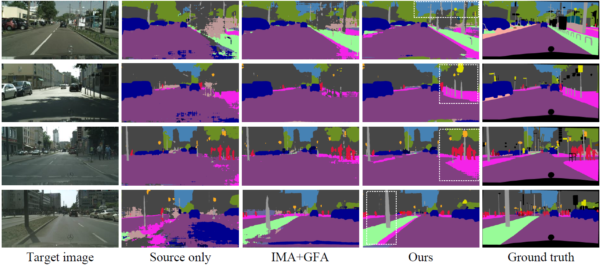
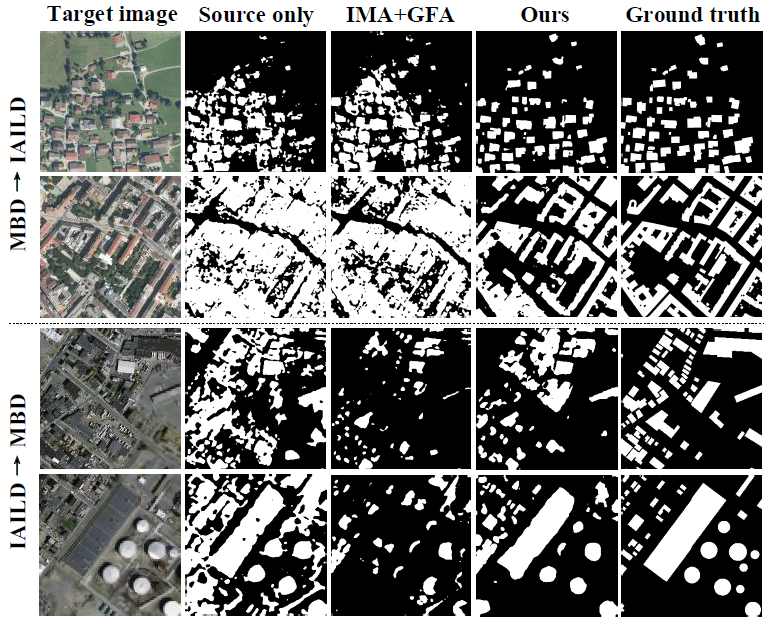
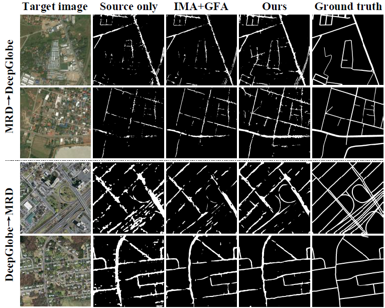

# Official code of "Birds of A Feather Flock Together: Category-Divergence Guidance for Domain Adaptive Segmentation. *IEEE Transactions on Image Processing*, 2022."

[Bo Yuan](https://scholar.google.com/citations?hl=zh-CN&user=CnOQPFAAAAAJ)<sup>1,2</sup>, [Danpei Zhao](https://scholar.google.com/citations?hl=zh-CN&user=1sgrmSQAAAAJ)<sup>1,2*</sup>, Shuai Shao<sup>3</sup>, Zehuan Yuan<sup>3</sup>, Changhu Wang<sup>3</sup>.

<sup>1</sup> <sub>Image Processing Center, BUAA</sub><br />
<sup>2</sup> <sub>Airvic Lab</sub><br />
<sup>3</sup> <sub>ByteDance AI-Lab</sub><br />

[]



### Update 2022-03-20

### Preparation
```python
git clone https://github.com/HibiscusYB/BAFFT.git     
cd BAFFT
```


### install inplace-abn
```python
pip install inplace-abn  
```

### install apex
```python
git clone https://github.com/NVIDIA/apex 
cd apex/      
pip setup.py install   
```

### Prepare Dataset

Download [Cityscapes](https://www.cityscapes-dataset.com/), [CycleGAN transferred GTA5](https://drive.google.com/open?id=1OBvYVz2ND4ipdfnkhSaseT8yu2ru5n5l) and [gta5 labels](https://drive.google.com/file/d/11E42F_4InoZTnoATi-Ob1yEHfz7lfZWg/view?usp=sharing). Symbolic link them under ``data`` folder: 

```python
ln -s path_to_Cityscapes_folder ./data/Cityscapes   
ln -s path_to_gta5_deeplab_folder ./data/gta5_deeplab    
ln -s path_to_gta5_labels_folder ./data/gta5_deeplab/labels       
```


### pretrained models
Download models and put them in ``./pretrained`` folder

BaiduNetDesk:
link: ``https://pan.baidu.com/s/1n_l9kJNFda5vNTKDE7b92g ``  
fetch code: j5a3     

Google Drive:
`` 
https://drive.google.com/drive/u/0/folders/1pMf0nQ5eawmGHlSQ9FWmHgboROtCfbFk 
``

## Quick Start
### GTA5 to Cityscapes:
#### Train: 
#### Step 1
```python
CUDA_VISIBLE_DEVICES=0 python train_step1.py  
python Generate_Pseudo_Label.py   
```
#### Step 2
```python
CUDA_VISIBLE_DEVICES=0 python train_step2.py  
```

### Inference & Evaluation
```python
python evaluate_cityscapes.py --restore-from ./pretrained/GTA2Cityscapes/GTA5_Best.pth   
python compute_iou.py ./data/Cityscapes/gtFine/val result/cityscapes   
```


## Results
### GTA5 to Cityscapes

### SYNTHIA to Cityscapes

### Visualizations





### *Airvic All Rights Reserved*
